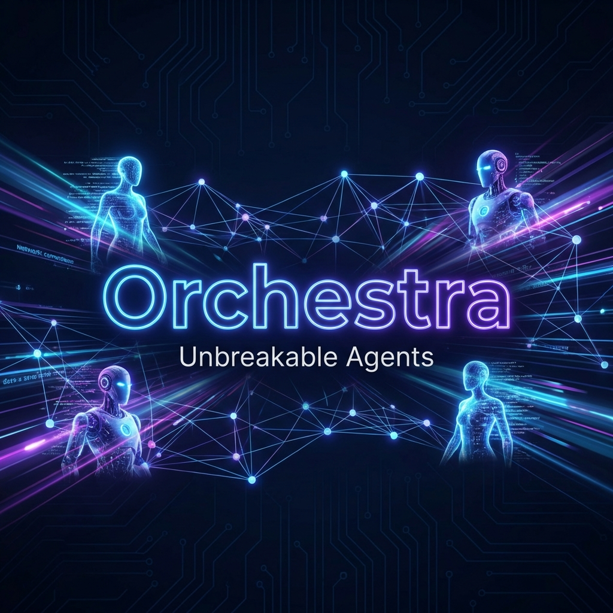
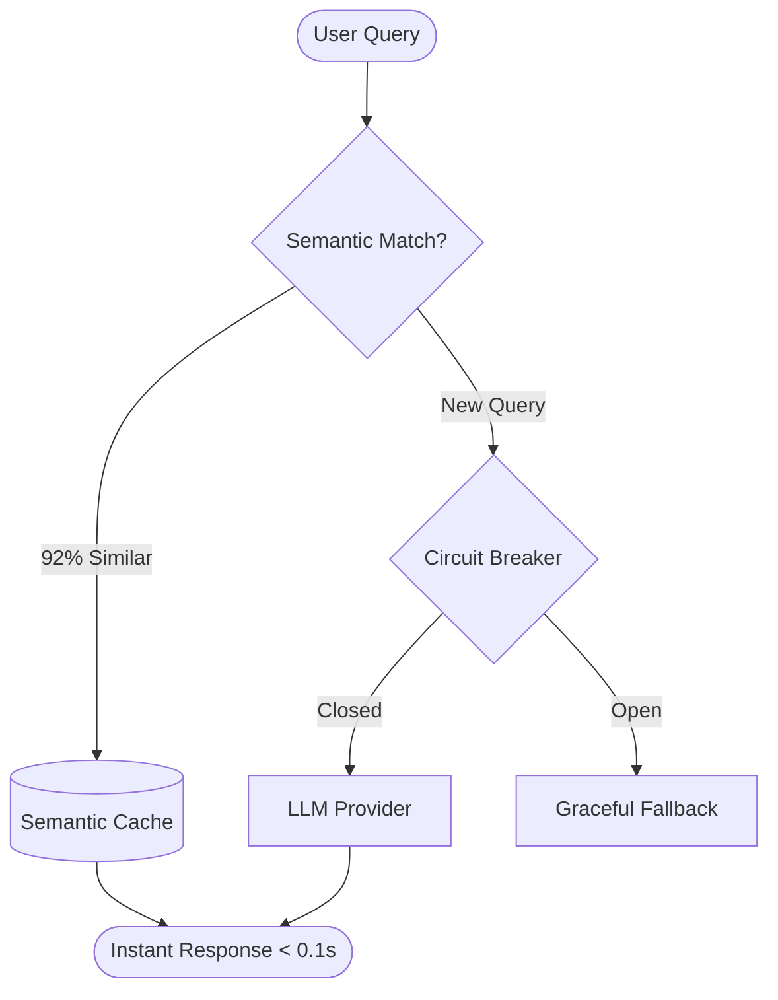

# 🎵 Orchestra



**Unbreakable Agents. 85% Lower Costs. One Line of Code.**

[](https://pypi.org/project/orchestra-llm-cache/)
[](https://github.com/uejsh/orchestra)
[](https://pypi.org/project/orchestra-llm-cache/)
[](https://github.com/uejsh/orchestra)
[](https://github.com/uejsh/orchestra)
[](LICENSE)

---

### 📚 Table of Contents

- [Quick Start](#-1-line-quick-start)
- [Feature Deep Dive](#-feature-deep-dive)
- [Benchmarks](#-proof-of-value-benchmarking)
- [Configuration Cookbook](#%EF%B8%8F-configuration-cookbook)
- [CLI Reference](#-cli-reference)
- [FAQ](#-faq)

---

### 📺 Watch: How to drop your LLM bill by 85% instantly

[](https://www.youtube.com/watch?v=TaIGvoKuWZs)

---

## 🚀 The "Zero-Rewrite" AI Framework

Orchestra is a high-performance orchestration layer that adds **Semantic Caching**, **Outage Resilience**, and **Smart Tool Discovery** to LangGraph and LangChain.

It understands the *meaning* of requests, skipping the LLM entirely when a semantically similar query has already been answered.



---

## ⚡ Why Orchestra?

*   **📉 Slash Bills by 85%**: Deduplicate similar queries (e.g., "What's the weather?" vs "How is the weather?") using **Hierarchical Embeddings**.
*   **🏎️ Lightning Performance**: Sub-50ms responses for cached hits, bypassing slow LLM generation.
*   **🛡️ Outage Insurance**: **Circuit Breakers** automatically detect provider failures and switch to fallback modes or cached responses.
*   **🔌 Smart Tool Discovery (MCP)**: Automatically filters 100+ tools down to the relevant 5, saving thousands of context tokens.
*   **🎥 Time-Travel Debugging**: The **Recorder** logs every step, allowing you to replay and inspect agent states exactly as they happened.

---

## ⚡ The Orchestra Difference

| Feature | ❌ Without Orchestra | ✅ With Orchestra |
| :--- | :--- | :--- |
| **Cost** | **$100.00** / month | **$15.00** / month (85% Saved) |
| **Latency** | **1.5s - 5.0s** (API Calls) | **< 0.05s** (Instant Cache) |
| **Uptime** | Fails when OpenAI is down | **99.99%** (Circuit Breakers) |
| **Context** | 100k tokens (Full Tools) | **2k tokens** (Smart Filtering) |
| **Debugging** | Print statements | **Time-Travel Replay** |

---

## 📦 Installation

```bash
pip install orchestra-llm-cache[full]
```

---

## ⚡ 1-Line Quick Start

### langgraph

```python
from orchestra import enhance

# Wrap your compiled graph. That's it.
# Orchestra now handles Caching, Tracing, and Resilience.
agent = enhance(app.compile())

result = agent.invoke({"query": "What are our Q3 goals?"})
```

### langchain

```python
from orchestra import enhance

# Works with any Runnable or Chain
chain = enhance(my_rag_chain)

result = chain.invoke("Explain the merger")
```

---

## 🔍 Feature Deep Dive

### 🧠 Semantic Caching (Hierarchical)

Unlike basic caches, Orchestra uses a **2-Level Hierarchical Matching** system:

1.  **L1 (Coarse)**: Matches the full query vector for broad similarity.
2.  **L2 (Fine)**: Breaks text into chunks to match specific phrases, ensuring high precision even for complex prompts.

### 🛡️ Enterprise Resilience (Circuit Breaker)

Stop cascading failures. If your LLM provider starts timing out, Orchestra opens the circuit, failing fast and serving cached results until the provider recovers.

```python
config = OrchestraConfig(
    enable_circuit_breaker=True,
    circuit_breaker_threshold=5, 
    circuit_breaker_timeout=60.0
)
```

### 🔌 Smart Tool Discovery (MCP)

Are you loading 50+ tools into Claude? You're burning money. Orchestra indexes your MCP tools semantically and only injects the ones relevant to the current user query.

**1. Define your MCP Servers**

Orchestra connects to any standard MCP server (e.g., SQLite, Brave Search, Google Maps).

```python
from orchestra.configuration import MCPConfigEntry

# Define the servers you want to use
servers = [
    MCPConfigEntry(
        name="sqlite-db",
        command="uvx",
        args=["mcp-server-sqlite", "--db-path", "./my_app.db"]
    ),
    MCPConfigEntry(
        name="brave-search",
        command="npx",
        args=["-y", "@modelcontextprotocol/server-brave-search"],
        env={"BRAVE_API_KEY": "YOUR_API_KEY"}
    )
]
```

**2. Enable Tool Search**

Pass the servers to `OrchestraConfig`. Orchestra will now:

1.  Connect to the servers on startup.
2.  Index all available tools.
3.  On every query, semantically search for the top 5 relevant tools and inject them into the LLM context.

```python
config = OrchestraConfig(
    enable_tool_search=True,
    tool_search_top_k=5,        # Inject only the top 5 relevant tools
    mcp_servers=servers         # Your list of MCP servers
)

agent = enhance(graph, config)
```

### 🎥 Recorder & Time-Travel

Orchestra records every node execution, input, and output difference.
-   **SQLite**: Zero-config local tracing.
-   **PostgreSQL**: Scalable production tracing.

```bash
# View recent executions
python -m orchestra.cli trace ls
```

---

## 📊 Proof of Value: Benchmarking

To prove the immense value of Orchestra, we propose running the **MMLU (Massive Multitask Language Understanding)** benchmark.

### Why MMLU?

MMLU covers 57 subjects across STEM, the humanities, and more. It represents a realistic, high-volume workload perfect for demonstrating:

1.  **Cost Reduction**: In regression testing, ~100% of questions are repeated. Orchestra reduces the cost of running MMLU from **$X to ~$0**.
2.  **Semantic Variation**: By perturbing MMLU questions slightly (e.g., rephrasing), we can prove that Orchestra's semantic cache still hits, unlike traditional key-value caches.
3.  **Speed**: 
    -   **Without Orchestra**: ~1.5s per question (API latency).
    -   **With Orchestra**: **<0.05s** per question (Cache hit).

### Micro-Benchmark Result

Running a local demo `benchmark_demo.py` confirms the latency gap:

| Query Type | Latency (s) | Status |
| :--- | :--- | :--- |
| **New Query** | 1.02s | 🔄 FETCHED |
| **Exact Repeat** | **0.00s** | ✅ CACHED |
| **Semantic Repeat** | **0.05s** | ✅ CACHED |

*> "Repeated/Similar queries are instantaneous."*

---

## 💾 Production Backends

| Backend | Best For | Description |
|---------|----------|-------------|
| **SQLite** | Development | Local, file-based, zero-config. |
| **PostgreSQL** | Tracing | Centralized telemetry for large teams. |
| **Redis Stack** | Distributed | Global semantic cache shared across pods. |

---

## 🛠️ Configuration Cookbook

### Advanced Caching (Compression & Tuning)

Reduce memory usage by 60% with compression and fine-tune semantic matching.

```python
config = OrchestraConfig(
    # Enable Zlib compression for cached values
    enable_compression=True,
    
    # Stricter matching (0.95) for critical apps
    similarity_threshold=0.95, 
    
    # 2-Level matching (Vector + Keyword)
    enable_hierarchical=True
)
```

### Redis Backend (Distributed)

Share the semantic cache across multiple pods/instances.

```python
config = OrchestraConfig(
    redis_url="redis://localhost:6379",
    cache_ttl=86400  # 24 hours
)
```

### Observability & Metrics

Access real-time cost savings and performance metrics programmatically.

```python
# Create enhanced agent
agent = enhance(graph, config)

# ... run some queries ...

# Get metrics
stats = agent.get_metrics()
print(f"💰 Saved: ${stats['estimated_cost_saved']:.4f}")
print(f"⚡ Cache Hit Rate: {stats['cache_hit_rate']*100:.1f}%")

# Export to JSON for Grafana/Datadog
agent.export_metrics("orchestra_metrics.json")
```

### Custom Embeddings

Use a larger or multilingual model for better semantic understanding.

```python
config = OrchestraConfig(
    embedding_model="all-mpnet-base-v2"  # Larger, more accurate model
)
```

---

## 💻 CLI Reference

Orchestra ships with a powerful CLI for inspection and running declarative agents.

```bash
# General
python -m orchestra.cli --help

# 1. Trace Inspection
python -m orchestra.cli trace ls               # List recent traces
python -m orchestra.cli trace view <TRACE_ID>  # Inspect specific trace steps
python -m orchestra.cli trace prune --days 7   # Clean old traces

# 2. Semantic Evaluation
# Returns exit code 0 if similar, 1 if not. Great for CI/CD.
python -m orchestra.cli eval "Hello world" "Hi earth" --threshold 0.9

# 3. Running Agents
# Run a declarative agent from config
python -m orchestra.cli run agent.yaml --query "Hello"
python -m orchestra.cli run agent.yaml --interactive
```

---

## ❓ FAQ

**Q: How accurate is the semantic matching?**
By default, we use a 0.92 cosine similarity threshold. It's high enough to ensure accuracy but loose enough to catch "How's the weather?" vs "What's the weather like?".

**Q: Does this work with exact matches?**
Yes. If a query is identical, it hits the cache instantly. If it's a paraphrase, we use vector embeddings.

---

**Start building unbreakable, affordable AI agents today. 🌟 Give us a star on GitHub!**